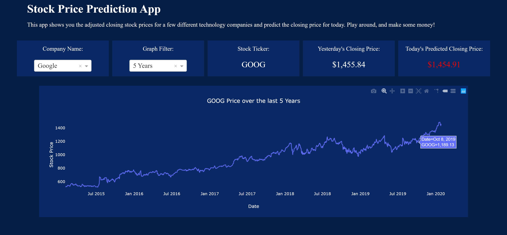

# Stock Price Prediction App

This app is designed to display the stock prices of the last 5 years for a few
different technology companies. It also uses machine learning to predict today's
closing stock price for each of the companies.





## Getting Started

### Prerequisites

You need to have Python installed on your computer and be able to run python
scripts through your terminal.

```
python example_script.py
```

### Installing

After cloning the repository, navigate to the folder, create and activate a virtual environment, and install the required packages in the requirements.txt file.

For Windows machines:
```
cd path/to/repo/folder
python -m venv env
cd env/scripts
activate
cd ../..
python -m pip install -r requirements.txt
```

### Running the App

Before you can run the web app, you need to first train the machine learning
models (should take less than a minute). If you do not train the models first,
the dash_app.py script will error out. Running this script will train a machine
learning model for each of the companies and save the model and StandardScaler
object into a models folder in the current working directory.

```
python train_models.py
```

After training the models, you need to run the dash_app.py script and navigate
to the url shown in the terminal.

```
python dash_app.py
```

## Built With

* [Plotly](https://plot.ly/python/plotly-express/) - The framework used to build the chart
* [Dash](https://plot.ly/dash/) - The framework used to build the web app
* [Scikit-Learn](https://scikit-learn.org/stable/) - The framework used to build the machine learning models
* [yfinance](https://pypi.org/project/yfinance/) - The API used to pull the stock price data from Yahoo! Finance

## Author's Info

- Portfolio - https://ryan-kp-miller.github.io/  
- Email - ryan.kp.miller@gmail.com

<!-- ## License

This project is licensed under the MIT License - see the [LICENSE.md](LICENSE.md) file for details -->
